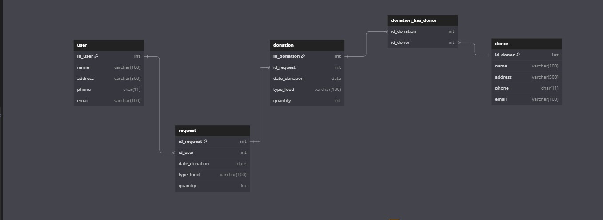

# Plataforma de Gestão de Doação de Alimentos

Este projeto foi desenvolvido como projeto final do Módulo 3 do Programadores do Amanhã. O projeto consistem em um banco de dados para uma plataforma de gestão de alimentos, incluindo a criação e consulta de registros de doadores, doações e solicitações.

## Sumário

- [Problemática e Solução](#problemática-e-solução)
- [Diagramas](#diagramas)
  - [Diagrama Conceitual](#diagrama-conceitual)
  - [Diagrama ER](#diagrama-er)
- [Scripts SQL](#scripts-sql)
- [Consultas de Análise de Dados](#consultas-de-análise-de-dados)
- [Gráficos das Análises](#gráficos-das-análises)
- [Casos de Uso](#casos-de-uso)
- [Instruções de Configuração](#instruções-de-configuração)
- [Licença](#licença)

## Problemática e Solução

A insegurança alimentar é uma realidade significativa no Brasil, afetando milhões de pessoas que enfrentam dificuldades para obter alimentos suficientes e nutritivos todos os dias. Este problema é agravado por desigualdades socioeconômicas, crises econômicas e desastres naturais, deixando muitos brasileiros em situações de vulnerabilidade alimentar.
Para enfrentar esse desafio, desenvolvemos uma plataforma de gestão de doação de alimentos baseada em um banco de dados robusto. Este banco de dados permite registrar e gerenciar eficientemente doações de alimentos, facilitando o fluxo de informações entre doadores, beneficiários e voluntários.

## Diagramas

### Diagrama Conceitual

O diagrama conceitual mostra os principais componentes do sistema e como eles estão interligados.

### Diagrama ER

O Diagrama ER (Entidade-Relacionamento) é baseado no diagrama conceitual e mostra as entidades e suas relações.

## Scripts SQL

Os scripts SQL para a criação do banco de dados, a inserção de dados e as consultas estão localizados no arquivo:

`./database-doacao-alimentos.sql`

Este arquivo contém:

- Criação do banco de dados e das tabelas.
- População das tabelas com dados de exemplo.
- Consultas SQL para análise de dados.

## Consultas de Análise de Dados

As consultas de análise de dados estão incluídas no arquivo de scripts SQL e foram projetadas para gerar insights sobre o comportamento das doações e solicitações de alimentos. Foram realizadas 3 consultas por membro da squad.

## Gráficos das Análises

Os gráficos gerados a partir das análises de dados estão disponíveis em uma planilha do Google Sheets. As imagens dos gráficos também estão disponíveis na pasta `graphs`.

**Link para a planilha com os gráficos:** [Acesse a planilha no Google Sheets](https://docs.google.com/spreadsheets/d/1u17-HvLD1yJelgWKPs1ZYYRzY6vXOphL2EObzA5Ctmo/edit?usp=sharing)

## Casos de Uso

1. **Registrar Solicitação de Doação**: Um usuário pode registrar uma nova solicitação de doação de alimentos.
2. **Registrar Doação**: Quando uma doação é feita, ela é registrada no banco de dados, associando o doador e a solicitação atendida.
3. **Análise de Dados**: Consultas SQL são utilizadas para gerar relatórios sobre doações, tipos de alimentos mais solicitados e mais doados, e para avaliar o desempenho dos doadores e usuários.

## Instruções de Configuração

1. **Instalação do MySQL**: Certifique-se de ter o MySQL instalado em seu sistema. Você pode baixar e instalar a partir do [site oficial do MySQL](https://dev.mysql.com/downloads/).
2. **Execução dos Scripts**:
    - Faça o download ou clone este repositório.
    - Abra o MySQL Workbench ou qualquer outro cliente de SQL que você utilize.
    - Execute o script SQL fornecido no arquivo `scripts/database-doacao-alimentos.sql` para criar o banco de dados, as tabelas e para inserir os dados de exemplo.

## Licença

Este projeto é licenciado sob os termos da [GNU General Public License (GPL)](LICENSE).
